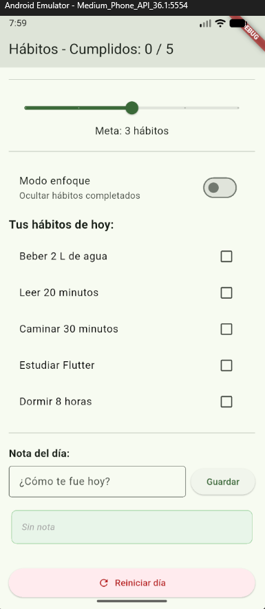
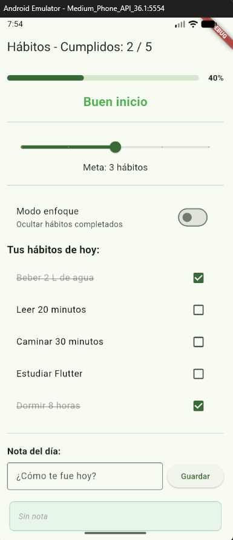
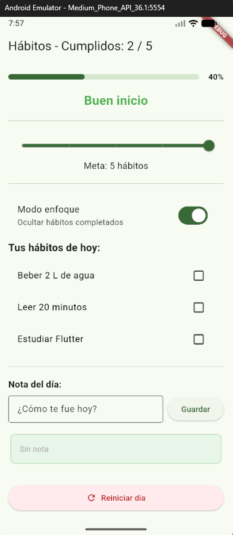
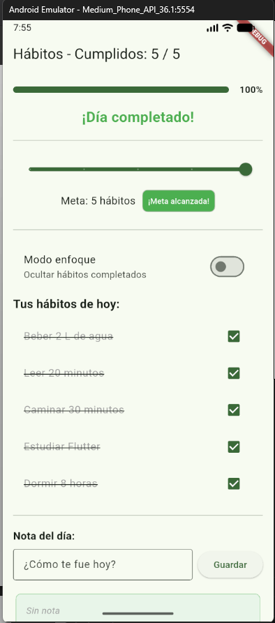
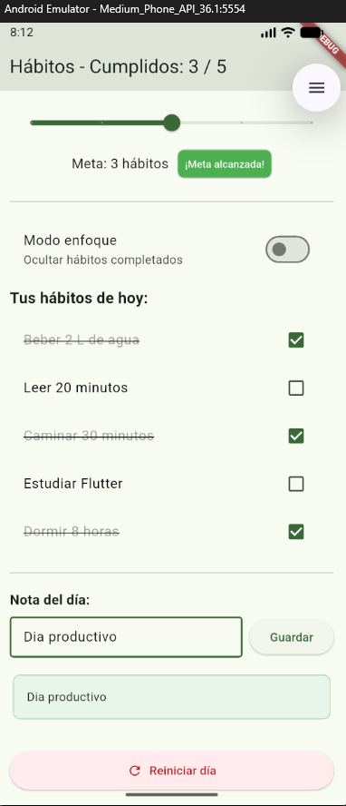
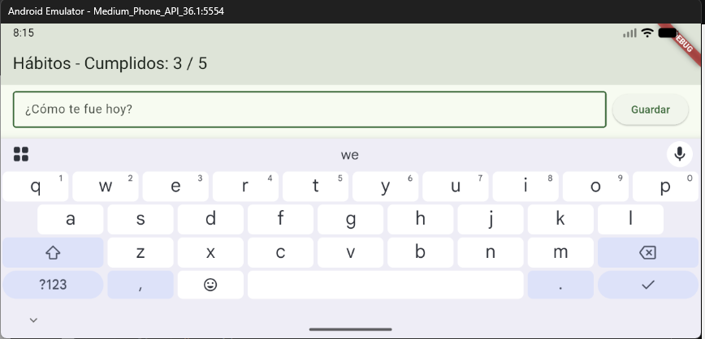

# Laboratorio 1: Panel de Hábitos del Día 📝

Este proyecto es una aplicación móvil desarrollada en Flutter diseñada para ayudar al usuario a realizar un seguimiento de sus hábitos diarios. La pantalla funciona como un panel interactivo ("Dashboard") que se actualiza en tiempo real mediante el uso exclusivo de `StatefulWidget` y `setState()`, reflejando el progreso del día sin usar paquetes de terceros para la gestión del estado.

## 📱 Descripción de la App

La aplicación muestra una lista fija de hábitos que el usuario puede marcar como completados. A medida que se interactúa con la lista, varios elementos de la interfaz reaccionan simultáneamente: un contador en el `AppBar`, una barra de progreso porcentual, y un mensaje motivacional dinámico. Además, incluye herramientas adicionales como la configuración de una meta diaria de hábitos, un "Modo Enfoque" para ocultar lo que ya se completó, y un espacio para guardar una pequeña nota reflexiva del día. Al final de la jornada, un botón permite reiniciar todos los valores al estado inicial.

## ⚙️ Variables de Estado Utilizadas

Para lograr el funcionamiento dinámico, toda la lógica reside en el `State` de la pantalla principal, utilizando las siguientes variables de estado independientes:

*   **`_cumplidos` (`List<bool>`):** Representa el estado de cada hábito en la lista (marcado/desmarcado). Se inicializa en `false` para todos.
*   **`_meta` (`int`):** Almacena la cantidad de hábitos que el usuario se propone cumplir en el día. Controlado mediante un `Slider`.
*   **`_enfoque` (`bool`):** Determina si el "Modo enfoque" está activo (`true`) o inactivo (`false`).
*   **`_nota` (`String`):** Almacena el texto definitivo de la nota del día, el cual se muestra en la tarjeta inferior tras presionar "Guardar".

> **Nota Técnica:** Variables como el total de cumplidos, el progreso porcentual y el mensaje motivacional no se guardaron como variables de estado para evitar la duplicación, sino que se derivaron a través de **Getters** calculados al vuelo (`_totalCumplidos`, `_progreso`, `_metaAlcanzada`, `_mensaje`).

## 📸 Capturas de Pantalla

A continuación, se muestran los distintos estados clave de la interfaz durante su uso:

| 1. Inicio del Día (P-10) | 2. Progreso Parcial (P-1) |
| :---: | :---: |
|  |  |

| 3. Modo Enfoque Activado (P-6) | 4. Día Completado (100%) (P-2) |
| :---: | :---: |
|  |  |

| 5. Guardar Nota (P-8) | 6. Rotar dispositivo / abrir teclado (P-12) |
| :---: | :---: |
|  |  |

## 🤔 Reflexión sobre el Manejo del Estado

Durante el desarrollo de esta práctica, un desafío importante relacionado con el estado fue comprender la diferencia entre mutar una variable y notificar a la interfaz de ese cambio. Por ejemplo, al principio podría cometerse el error de simplemente hacer `_cumplidos[index] = !_cumplidos[index]` o limpiar la nota con `_notaCtrl.clear()` fuera de la función `setState()`. Si bien las variables cambiarían en la memoria, la pantalla no se actualizaría para mostrar las casillas marcadas o el campo vacío. Lo evité y resolví asegurándome de que toda mutación de datos que afecte lo visual estuviera siempre envuelta dentro del bloque `setState(() { ... });`, garantizando así que Flutter llame de nuevo al método `build()` y sincronice la interfaz con la verdad de los datos.

---
**Desarrollado por:** Lenny Alexander Servino Henriquez
**Tecnología:** Flutter (3.x+) / Dart
